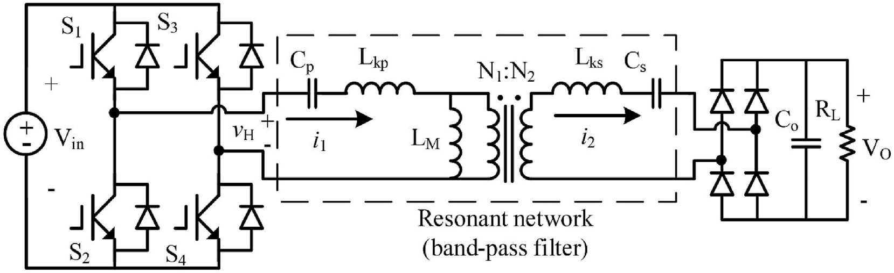

Wireless power transfer (WPT) systems move energy across an air gap using a **resonant converter**: an H-bridge inverter drives a resonant tank (inductors and capacitors) that couples through two loosely-coupled coils, and the received AC is turned back into DC by a **diode-bridge rectifier**. Getting the steady-state behavior of this converter right — the current and voltage waveforms it settles into — is what lets engineers size components and predict output power before building hardware. The problem is that the diode-bridge rectifier is genuinely non-linear (it switches on and off depending on the polarity of the incoming current), so the waveforms it produces are distorted, not pure sine waves. The industry-standard shortcut, **Fundamental Harmonic Approximation (FHA)**, ignores that distortion and only tracks the fundamental-frequency component. It is fast, but the paper shows it breaks down once the converter is driven away from its resonant point — and that emerging, higher-power-density WPT designs, which deliberately inject extra harmonics, push it into exactly that regime.

Prior frequency-domain models that do account for higher harmonics beyond FHA exist, but each one leans on a simplifying assumption to stay solvable: some fix the source driving the resonant network to an idealized sine wave, while others allow an arbitrary source but force the rectifier's DC-side output to be a fixed voltage, a square wave, a pre-specified voltage/current source, or — at best — a purely inductive load. Those assumptions break down for more general, realistic WPT loads, such as the paper's own test hardware, where an output LC filter sits between the rectifier and a resistive load — a combination none of the earlier fixed-output assumptions can fully capture. This paper's contribution is a model that keeps arbitrary input and output configurations while cutting the model down to a **single unknown variable** — an "offset angle" describing where the rectifier's input current crosses zero relative to the inverter's output voltage — solved through nothing more than matrix operations (no integration or differentiation needed).

The method works in three steps. First, the non-linear diode-bridge rectifier is captured with a harmonic (Fourier-domain) admittance/impedance matrix that relates every harmonic of the AC-side current and voltage to the DC-side output — including a later refinement that adds the diodes' own forward-voltage drop, which matters most for low-output-voltage or high-frequency designs. Second, the passive resonant network (whatever combination of L's and C's the designer chose) is folded in as an ordinary linear two-port network. Combining the two collapses the whole system into one equation with a single unknown: the offset angle. That angle is found by an iterative one-dimensional search — starting from an FHA-based initial guess and refined with a parabolic-interpolation search — which the paper shows converges in under ten iterations, versus gradient-descent methods that can fail outright because the underlying error function isn't smooth.

To validate the model, the authors built two hardware WPT prototypes — one with series-series (SS) compensation, one with LCC compensation, both based on a dual-coil Qi-style transmitter/receiver — and compared the model's predicted waveforms against PSIM time-domain simulation and bench measurements.

.")

The proposed model tracks the measured and simulated waveforms closely, including the current distortion that FHA smooths away — FHA's calculated peak current comes out roughly 16% above the experimental value. On output-power estimation, FHA is off by about 18% for the SS prototype at full load (about 15% at half load), while the proposed method lands within roughly 1-2% of the measured output power at both load points (the paper's headline "10% improvement" figure, from the abstract). The match is noticeably looser for the LCC prototype — about 11% output-power error at full load, versus about 3% at half load — which the authors attribute mainly to the small-signal LCR-meter measurement of the coils (taken at only 500 mV excitation) not fully capturing the coupled inductor's real, non-linear behavior: its effective AC resistance turns out to be roughly five times higher at the third harmonic than at the fundamental frequency, and its behavior also shifts with current level, rather than reflecting a limitation of the frequency-domain method itself. The authors are explicit that the model is currently restricted to continuous current mode (CCM) — it does not yet cover the discontinuous-current regime that shows up under light loads — and that resonant networks with richer harmonic content (like LCC) need a higher-order harmonic matrix, which increases computation cost and is left for future work.

