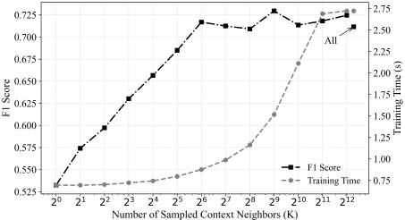

Road networks are the backbone input for tasks like traffic prediction and autonomous navigation, but representing them well is hard: they are large, their topology keeps changing, and most of the useful context around a road (nearby shops, amenities, land use) exists only as unstructured text rather than a tidy set of features. Graph neural networks such as GCN, GAT, and GraphSAGE improved on hand-crafted road attributes by learning from network topology, but they typically look only at the roads themselves and ignore this surrounding semantic context, or risk adding noise if it is folded in without a principled mechanism.

This paper proposes **HetSemNet + SaRNSAGE**, a two-part framework for fusing that semantic context with road topology:

- **HetSemNet** turns the road network into a *heterogeneous* graph with two node types: road nodes (initialized with structural attributes like segment length and speed limit) and context nodes representing nearby points of interest (POIs). Roads connect to each other along real road connectivity, and each road also connects to nearby context nodes within a spatial search radius, with the connection weighted by a distance-based decay so that closer POIs count for more. Context nodes are not linked to one another, which keeps their influence local. Each context node's text description (e.g., a facility name or category) is turned into a fixed-size vector by a frozen, pre-trained language model, so the graph carries topology and semantics side by side.
- **SaRNSAGE** is a GraphSAGE-style encoder adapted to this richer graph. For each road node, it mean-aggregates information from *all* of its road neighbors, and separately mean-aggregates information from a fixed number of *sampled* context neighbors. It also computes a second, simpler signal from that same sampled set of context neighbors: a plain average of their raw, un-aggregated LLM embeddings, so that fine-grained semantic detail isn't lost when the learned aggregation compresses it. These signals — road, aggregated context, and raw context — are concatenated and passed through a learned update to produce the road's embedding. The encoder itself is trained self-supervised, without labels: connected road pairs are treated as positive examples and randomly-sampled unconnected pairs as negatives, optimized with a binary cross-entropy loss.

The learned embeddings were evaluated on a road-type classification task, using real urban road-network data from Porto split 7:2:1 into train/validation/test, with the encoder frozen and only a small MLP classifier trained on top for evaluation. Every graph-based baseline beat a handcrafted-feature MLP (F1 = 0.4835), but adding semantic context produced the largest jumps: even a simple mean-pooling of POI embeddings (SaMean) lifted F1 by 29.53% over that baseline, and the full SaRNSAGE model reached the best overall F1 of 0.7296 — a 50.90% improvement over the handcrafted baseline and a 16.50% improvement over SaMean. This beat every other baseline tested, including semantic-augmented versions of GCN, GAT, and GraphSAGE (which, per the paper, still operate on a homogeneous, road-only graph even in this comparison) and SaHAN, a heterogeneous graph-attention baseline that, like SaRNSAGE, runs on the full HetSemNet graph.

Because SaRNSAGE only needs to sample a fixed, small neighborhood around each node, it can produce embeddings for roads and cities it has never seen without retraining. The paper tests this directly with a cross-city transfer experiment: a model trained only on Porto is applied, unchanged, to Lisbon, a city that differs noticeably from Porto in layout, scale, and facility distribution. The transferred model reaches an F1 of 0.6766 — only 4.71% below its own in-domain Porto score (0.7296) and only 2.90% below a model trained from scratch directly on Lisbon (0.6968) — indicating that most of what the network learns carries over across cities rather than overfitting to one city's layout.

A separate sweep over the number of sampled context neighbors, K, tells a complementary efficiency story: F1 rises quickly with K and then levels off, while training time keeps climbing steeply as K grows, and using every nearby POI with no sampling at all ("All" in the figure) adds a large amount of extra training time for essentially no further gain in accuracy. This is the practical case for SaRNSAGE's sampling-and-aggregation design: a moderate, fixed sample size gets most of the benefit of semantic context at a fraction of the computational cost, which matters for deploying the model on large, evolving road networks where full retraining is impractical.
